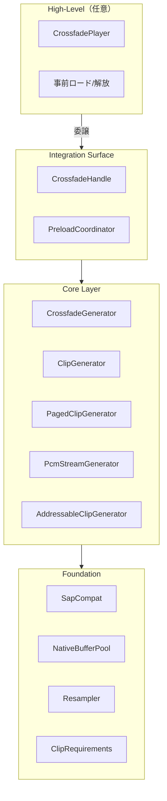

## CrossfadeAudio

# Unity 6.3 Scriptable Audio Pipeline クロスフェードライブラリ 技術設計書（v1.1.0）

**バージョン**: v1.1.0 — Resampling / Streaming（ページング＋外部PCM入力）/ NativeBufferPool（＋ v1.0.4 方針維持）

| 項目      | 内容                                                     |
| ------- | ------------------------------------------------------ |
| 対応Unity | Unity 6.3.4f1以降（SAP: Scriptable Audio Pipeline）        |
| 必須パッケージ | com.unity.burst                                        |
| 任意パッケージ | com.unity.addressables（Addressables拡張を使う場合のみ・別 asmdef） |
| 外部依存    | なし（Addressables は任意で分離）                                |

---

## 0. 改訂概要

### 0.1 v1.0.4 方針（継続）

* **SapCompat**: SAP の更新影響が出やすい箇所（Finished 判定 / Pipe / ChannelBuffer生成など）を境界隔離
* **Ownership（所有権）明文化 + Release 冪等**: Addressables 等と組み合わせたときに破綻しにくい（ロード/リリースを契約化）
* **CrossfadeHandle**: 非 MonoBehaviour 操作面（制御層から安全に扱える）

SAP の Control/Realtime 通信や制御は ControlContext が担い、決定論的なデータ通信を提供する（builtIn の利用または手動 context の生成が可能）。 ([Unity ドキュメント][1])
GeneratorInstance は AudioSource.generator からインスタンス化されて利用される。 ([Unity ドキュメント][2])

### 0.2 v1.1.0 追加

* **Resampling（sampleRate 不一致吸収）**

  * 従来: 不一致は無音 fallback
  * v1.1.0: `ResampleMode.Auto` を標準とし、不一致でも再生継続（品質選択あり）
* **Streaming（大容量対応）**

  * (A) **PagedClipGenerator**: AudioClip をページング（全PCMコピーを回避）
  * (B) **PcmStreamGenerator**: 外部 PCM 供給（真のストリーミング入力）
  * 重要: Unity 仕様として `AudioClip.GetData` は **streamed audio clips では動作しない**ため、「Load Type=Streaming の AudioClip を GetData で読む」方式は採用しない。 ([Unity ドキュメント][3])
* **NativeBufferPool（再Configure/多インスタンス環境の負荷低減）**

  * Control 側の `NativeArray<float>(Persistent)` の確保/破棄を抑制してスパイク低減

---

## 1. プロジェクト概要

### 1.1 背景と目的

Unity 6.3 の SAP により、従来の AudioMixer/OnAudioFilterRead では難しかった “サンプル精度の処理” を Burst 最適化で行える。
本ライブラリは SAP 上で **クロスフェード再生（2ソース）**を実装し、BGM 遷移などで **サンプル精度**かつ **例外ゼロ（クラッシュ誘発を避ける）**を提供する。

### 1.2 主要機能（v1.1.0）

* 2ソースのサンプル精度クロスフェード
* カーブ: Equal-Power / Linear / S-Curve
* Control/Realtime 分離 + Pipe 通信（ロックフリー前提）
* 無音 fallback（未設定/未ロード/要件不適合でも継続）
* Resampling（Off/Auto/Force + 品質）
* Streaming:

  * PagedClip（ページング）
  * PcmStream（外部 PCM 供給）
* BufferPool（Control 側メモリ再利用）
* Addressables（任意・別 asmdef）: 所有権ルールを守って組み合わせ可能

  * AssetReference は Unity が自動で load/release しないため、明示的なロード/解放が必要。 ([Unity ドキュメント][4])

---

## 2. スコープ方針（“クロスフェード特化”を維持）

### 2.1 ライブラリ内に入れるもの

* クロスフェードの正確さ・堅牢性・統合性に直結する基盤（Resampling / Streaming入口 / Pool / Ownership）

### 2.2 ライブラリ内に入れないもの

* 音声デコード（mp3/ogg等）やネットワーク IO

  * 外部ライブラリ責務。CrossfadeAudio は “PCM を受け取って再生できる入口” を提供する。

---

## 3. アーキテクチャ

### 3.1 階層構造



### 3.2 ディレクトリ構成

```
Assets/
└── CrossfadeAudio/
    ├── Runtime/
    │   ├── Core/
    │   │   ├── CrossfadeAudio.Core.asmdef              ★ Addressables 参照なし（本体）
    │   │   │
    │   │   ├── Foundation/
    │   │   │   ├── SapCompat.cs                        ★ 継続（SAP差分隔離）
    │   │   │   ├── ClipRequirements.cs                 ★ 継続（GetData要件ガード）
    │   │   │   ├── NativeBufferPool.cs                 ★ 追加（Control側のみ）
    │   │   │   ├── Resampling/
    │   │   │   │   ├── ResampleMode.cs                 ★ 追加
    │   │   │   │   ├── ResampleQuality.cs              ★ 追加
    │   │   │   │   └── Resampler.cs                    ★ 追加
    │   │   │   └── (optional) Diagnostics/             ★ 任意（ログ/検証フラグなど）
    │   │   │
    │   │   ├── Types/                                  ★ “Core/Core” の二重を解消
    │   │   │   ├── CrossfadeCurve.cs
    │   │   │   ├── CrossfadeCommand.cs
    │   │   │   ├── CrossfadeRealtimeParams.cs
    │   │   │   ├── PageReady.cs                        ★ 追加（Paging/Stream用）
    │   │   │   └── IPcmPageProvider.cs                 ★ 追加（外部PCM供給）
    │   │   │
    │   │   ├── Generators/
    │   │   │   ├── Clip/
    │   │   │   │   ├── ClipGeneratorAsset.cs
    │   │   │   │   ├── ClipControl.cs
    │   │   │   │   └── ClipRealtime.cs
    │   │   │   │
    │   │   │   ├── Crossfade/
    │   │   │   │   ├── CrossfadeGeneratorAsset.cs
    │   │   │   │   ├── CrossfadeControl.cs
    │   │   │   │   └── CrossfadeRealtime.cs
    │   │   │   │
    │   │   │   ├── PagedClip/                          ★ 追加（AudioClipページング）
    │   │   │   │   ├── PagedClipGeneratorAsset.cs
    │   │   │   │   ├── PagedClipControl.cs
    │   │   │   │   └── PagedClipRealtime.cs
    │   │   │   │
    │   │   │   └── PcmStream/                          ★ 追加（外部PCMストリーム）
    │   │   │       ├── PcmStreamGeneratorAsset.cs
    │   │   │       ├── PcmStreamControl.cs
    │   │   │       └── PcmStreamRealtime.cs
    │   │   │
    │   │   ├── Integration/
    │   │   │   └── CrossfadeHandle.cs                  ★ 継続
    │   │   │
    │   │   └── Components/
    │   │       └── CrossfadePlayer.cs                  ★ 継続（薄いMonoBehaviour）
    │   │
    │   └── README.md
    │
    ├── Addressables/                                   ★ 任意（別 asmdef / 依存分離）
    │   ├── CrossfadeAudio.Addressables.asmdef
    │   ├── IPreloadableAudioGenerator.cs
    │   └── AddressableClipGeneratorAsset.cs
    │
    ├── Tests/                                          ★ 任意
    └── Samples~/                                       ★ 任意（配布するなら）
        ├── ClipCrossfade/
        ├── PagedClipCrossfade/
        └── PcmStreamCrossfade/
```

### 3.3 SAP コア概念（設計で依存するポイント）

* `ChannelBuffer` は channels×frames の 2D ビューとしてサンプルデータを扱う（内部レイアウト抽象）。 ([Unity ドキュメント][5])
* Realtime は allocation-free / exception-free を前提に実装する（公式例の前提）。 ([Unity ドキュメント][6])

---

## 4. 設計ルール（全コンポーネント共通）

### 4.1 Null 安全性・例外ゼロ

* Clip 未設定、ロード失敗、要件不適合、バッファ不整合、子 generator 未生成等でも **例外を出さず**、**無音で継続**する。
* Debug.Log は Control 側（Editor/Dev build）に限定し、Realtime 側は一切 Unity API を呼ばない。

### 4.2 再Configure 耐性

* Configure が複数回呼ばれる前提で、Control 側は確保リソースを確実に解放（Return/Dispose）する。

### 4.3 Ownership（所有権）ルール

* 「誰がロードし、誰が解放するか」を明文化する。
* Addressables を使う場合、AssetReference は自動 load/release されないため、Handle/Release を契約化する。 ([Unity ドキュメント][4])
* `Release()` は冪等（複数回呼んでも安全）に設計する。

---

## 5. Foundation

## 5.1 SapCompat（SAP境界隔離）

```csharp
using System.Runtime.CompilerServices;
using UnityEngine.Audio;

namespace CrossfadeAudio
{
    internal static class SapCompat
    {
        [MethodImpl(MethodImplOptions.AggressiveInlining)]
        public static bool IsFinished(in GeneratorInstance.Result result)
            => result.Equals(GeneratorInstance.Result.Finished);

        [MethodImpl(MethodImplOptions.AggressiveInlining)]
        public static void SendData<T>(Pipe pipe, ControlContext context, in T payload)
            where T : unmanaged
            => pipe.SendData(context, payload);

        [MethodImpl(MethodImplOptions.AggressiveInlining)]
        public static Pipe.DataIterator GetAvailableData(Pipe pipe, UpdatedDataContext context)
            => pipe.GetAvailableData(context);

        [MethodImpl(MethodImplOptions.AggressiveInlining)]
        public static ChannelBuffer MakeChannelBuffer(Unity.Collections.NativeArray<float> buffer, int channelCount)
            => new ChannelBuffer(buffer, channelCount);
    }
}
```

> `Pipe.DataIterator` 等の名称や `SendData`/`GetAvailableData` の形状は Unity マイナー更新で差分が出る可能性があるため、差分吸収はここに集約する（v1.0.4 方針）。

---

## 5.2 NativeBufferPool（Control 側 NativeArray 再利用）

* 目的: 再Configure 頻発/多インスタンスでの確保/破棄スパイク低減
* 注意: Control 側のみで使用（Realtime では使用しない）
* 上限: `MaxPerSize` / `MaxTotalFloats` を持ち暴走防止

```csharp
using System.Collections.Generic;
using Unity.Collections;

namespace CrossfadeAudio
{
    internal static class NativeBufferPool
    {
        public static int MaxPerSize = 8;
        public static long MaxTotalFloats = 8L * 1024L * 1024L; // 8M floats ≒ 32MB

        private static long s_totalFloats;
        private static readonly Dictionary<int, Stack<NativeArray<float>>> s_pool = new();

        public static NativeArray<float> Rent(int length)
        {
            if (length <= 0) return default;

            if (s_pool.TryGetValue(length, out var stack) && stack.Count > 0)
            {
                var arr = stack.Pop();
                return arr.IsCreated ? arr : new NativeArray<float>(length, Allocator.Persistent);
            }

            s_totalFloats += length;
            return new NativeArray<float>(length, Allocator.Persistent);
        }

        public static void Return(ref NativeArray<float> array)
        {
            if (!array.IsCreated)
            {
                array = default;
                return;
            }

            int length = array.Length;

            if (s_totalFloats > MaxTotalFloats)
            {
                array.Dispose();
                array = default;
                return;
            }

            if (!s_pool.TryGetValue(length, out var stack))
            {
                stack = new Stack<NativeArray<float>>(MaxPerSize);
                s_pool[length] = stack;
            }

            if (stack.Count >= MaxPerSize)
            {
                array.Dispose();
                array = default;
                return;
            }

            stack.Push(array);
            array = default;
        }

        public static void DisposeAll()
        {
            foreach (var kv in s_pool)
            {
                var stack = kv.Value;
                while (stack.Count > 0)
                {
                    var arr = stack.Pop();
                    if (arr.IsCreated) arr.Dispose();
                }
            }
            s_pool.Clear();
            s_totalFloats = 0;
        }
    }
}
```

---

## 5.3 Resampling

### 5.3.1 API

```csharp
namespace CrossfadeAudio
{
    public enum ResampleMode
    {
        Off,    // 不一致は無音 fallback（従来互換）
        Auto,   // 不一致なら resample（推奨）
        Force   // 一致でも resample（検証用途）
    }

    public enum ResampleQuality
    {
        Nearest,
        Linear,
        Hermite4
    }
}
```

### 5.3.2 Resampler（Burst互換）

```csharp
using Unity.Mathematics;

namespace CrossfadeAudio
{
    internal static class Resampler
    {
        public static float Hermite4(float xm1, float x0, float x1, float x2, float t)
        {
            float c0 = x0;
            float c1 = 0.5f * (x1 - xm1);
            float c2 = xm1 - 2.5f * x0 + 2f * x1 - 0.5f * x2;
            float c3 = 0.5f * (x2 - xm1) + 1.5f * (x0 - x1);
            return ((c3 * t + c2) * t + c1) * t + c0;
        }

        public static float Interp(ResampleQuality q, float xm1, float x0, float x1, float x2, float t)
        {
            switch (q)
            {
                case ResampleQuality.Nearest:
                    return x0;
                case ResampleQuality.Hermite4:
                    return Hermite4(xm1, x0, x1, x2, t);
                default:
                    return math.lerp(x0, x1, t);
            }
        }
    }
}
```

---

## 5.4 ClipRequirements（GetData 要件）

`AudioClip.GetData` の仕様:

* 圧縮音源は Import 設定で **Load Type を Decompress on Load にしないと取得できない**
* **Streamed audio clips では GetData は動作しない**
* 失敗時は data が 0 で埋まり、エラーが出て false を返す ([Unity ドキュメント][3])

```csharp
using UnityEngine;

namespace CrossfadeAudio
{
    public static class ClipRequirements
    {
        public static bool CanUseGetData(AudioClip clip)
        {
            if (clip == null) return false;

            // GetData は streamed clip では動作しない :contentReference[oaicite:8]{index=8}
            if (clip.loadType == AudioClipLoadType.Streaming) return false;

            // DecompressOnLoad のみ確実 :contentReference[oaicite:9]{index=9}
            return clip.loadType == AudioClipLoadType.DecompressOnLoad;
        }

        public static bool EnsureLoaded(AudioClip clip)
        {
            if (clip == null) return false;

            if (clip.loadState == AudioDataLoadState.Unloaded)
                return clip.LoadAudioData();

            return clip.loadState == AudioDataLoadState.Loaded;
        }
    }
}
```

---

## 6. Core（共通データ型）

## 6.1 CrossfadeCurve

```csharp
namespace CrossfadeAudio
{
    public enum CrossfadeCurve
    {
        EqualPower,
        Linear,
        SCurve
    }
}
```

## 6.2 CrossfadeCommand / CrossfadeRealtimeParams

```csharp
using Unity.Mathematics;

namespace CrossfadeAudio
{
    public struct CrossfadeCommand
    {
        public readonly float TargetPosition;   // 0=A, 1=B
        public readonly float DurationSeconds;  // 秒
        public readonly CrossfadeCurve Curve;

        public CrossfadeCommand(float target, float durationSeconds, CrossfadeCurve curve)
        {
            TargetPosition = math.clamp(target, 0f, 1f);
            DurationSeconds = math.max(0.001f, durationSeconds);
            Curve = curve;
        }
    }

    internal readonly struct CrossfadeRealtimeParams
    {
        public readonly float TargetPosition;
        public readonly float DurationSamples;
        public readonly CrossfadeCurve Curve;

        public CrossfadeRealtimeParams(float targetPosition, float durationSamples, CrossfadeCurve curve)
        {
            TargetPosition = targetPosition;
            DurationSamples = durationSamples;
            Curve = curve;
        }
    }
}
```

---

## 7. ClipGenerator（AudioClip再生 + Resampling）

### 7.1 ClipGeneratorAsset

```csharp
using UnityEngine;
using UnityEngine.Audio;
using Unity.IntegerTime;

namespace CrossfadeAudio
{
    [CreateAssetMenu(fileName = "ClipGenerator", menuName = "CrossfadeAudio/Clip Generator")]
    public class ClipGeneratorAsset : ScriptableObject, IAudioGenerator
    {
        public bool isFinite => !_loop;
        public bool isRealtime => false;
        public DiscreteTime? length => null;

        [SerializeField] private AudioClip _clip;
        [SerializeField] private bool _loop = true;

        [Header("Resampling")]
        [SerializeField] private ResampleMode _resampleMode = ResampleMode.Auto;
        [SerializeField] private ResampleQuality _resampleQuality = ResampleQuality.Linear;

        public GeneratorInstance CreateInstance(
            ControlContext context,
            AudioFormat? nestedFormat,
            ProcessorInstance.CreationParameters creationParameters)
        {
#if UNITY_EDITOR || DEVELOPMENT_BUILD
            if (_clip != null && !ClipRequirements.CanUseGetData(_clip))
                Debug.LogWarning($"[ClipGenerator] AudioClip '{_clip.name}' が GetData 要件を満たしません。無音fallbackします。");
#endif
            var realtime = new ClipRealtime();
            var control = new ClipControl(_clip, _loop, _resampleMode, _resampleQuality);

            return context.AllocateGenerator(realtime, control, nestedFormat, creationParameters);
        }
    }
}
```

### 7.2 ClipControl（Control側）

```csharp
using System;
using Unity.Collections;
using UnityEngine;
using UnityEngine.Audio;

namespace CrossfadeAudio
{
    public struct ClipControl : GeneratorInstance.IControl<ClipRealtime>
    {
        private readonly AudioClip _clip;
        private readonly bool _loop;
        private readonly ResampleMode _resampleMode;
        private readonly ResampleQuality _resampleQuality;

        private NativeArray<float> _clipData;
        private bool _initialized;
        private int _clipChannels;
        private int _clipFrames;
        private int _clipSampleRate;

        public ClipControl(AudioClip clip, bool loop, ResampleMode mode, ResampleQuality quality)
        {
            _clip = clip;
            _loop = loop;
            _resampleMode = mode;
            _resampleQuality = quality;

            _clipData = default;
            _initialized = false;
            _clipChannels = 0;
            _clipFrames = 0;
            _clipSampleRate = 0;
        }

        public void Configure(
            ControlContext context,
            ref ClipRealtime realtime,
            in AudioFormat format,
            out GeneratorInstance.Setup setup,
            ref GeneratorInstance.Properties properties)
        {
            setup = new GeneratorInstance.Setup(format.speakerMode, format.sampleRate);

            if (_clip == null)
            {
                SetupSilence(ref realtime, (int)format.sampleRate);
                return;
            }

            // ロード状態を確認し、必要ならロード（Control側でのみ実施）
            if (!ClipRequirements.EnsureLoaded(_clip))
            {
                SetupSilence(ref realtime, (int)format.sampleRate);
                return;
            }

            // GetData 要件（streamed不可、DecompressOnLoad推奨） :contentReference[oaicite:10]{index=10}
            if (!ClipRequirements.CanUseGetData(_clip))
            {
                SetupSilence(ref realtime, (int)format.sampleRate);
                return;
            }

            int dstRate = (int)format.sampleRate;

            if (!_initialized)
            {
                _clipChannels = _clip.channels;
                _clipFrames = _clip.samples;
                _clipSampleRate = _clip.frequency;

                int sampleCount = _clipFrames * _clipChannels;
                _clipData = new NativeArray<float>(sampleCount, Allocator.Persistent);

                // NativeArray.AsSpan が利用可能（Unity 6000.3+） :contentReference[oaicite:11]{index=11}
                Span<float> span = _clipData.AsSpan();
                bool ok = _clip.GetData(span, 0); // GetData は streamed clip では動作しない :contentReference[oaicite:12]{index=12}
                if (!ok)
                {
                    if (_clipData.IsCreated) _clipData.Dispose();
                    _clipData = default;
                    SetupSilence(ref realtime, dstRate);
                    return;
                }

                _initialized = true;
            }

            realtime.clipData = _clipData;
            realtime.clipChannels = _clipChannels;
            realtime.clipTotalFrames = _clipFrames;
            realtime.loop = _loop;

            realtime.srcSampleRate = _clipSampleRate;
            realtime.dstSampleRate = dstRate;
            realtime.resampleMode = _resampleMode;
            realtime.resampleQuality = _resampleQuality;
        }

        public void Update(ControlContext context, Pipe pipe) { }

        public Response OnMessage(ControlContext context, Pipe pipe, Message message)
            => Response.Unhandled;

        public void Dispose(ControlContext context, ref ClipRealtime realtime)
        {
            if (_clipData.IsCreated) _clipData.Dispose();
            _clipData = default;
        }

        private static void SetupSilence(ref ClipRealtime realtime, int dstRate)
        {
            realtime.clipData = default;
            realtime.clipChannels = 0;
            realtime.clipTotalFrames = 0;
            realtime.loop = false;

            realtime.srcSampleRate = 0;
            realtime.dstSampleRate = dstRate;
            realtime.resampleMode = ResampleMode.Off;
            realtime.resampleQuality = ResampleQuality.Linear;
        }
    }
}
```

### 7.3 ClipRealtime（Realtime側）

```csharp
using Unity.Burst;
using Unity.Collections;
using Unity.Mathematics;
using UnityEngine.Audio;
using Unity.IntegerTime;

namespace CrossfadeAudio
{
    [BurstCompile(CompileSynchronously = true, FloatMode = FloatMode.Fast, FloatPrecision = FloatPrecision.Medium)]
    public struct ClipRealtime : GeneratorInstance.IRealtime
    {
        [ReadOnly] public NativeArray<float> clipData;
        public int clipChannels;
        public int clipTotalFrames;
        public bool loop;

        public int srcSampleRate;
        public int dstSampleRate;
        public ResampleMode resampleMode;
        public ResampleQuality resampleQuality;

        private long _posFrame;
        private double _srcFramePos;
        private bool _finished;

        public bool isFinite => !loop;
        public bool isRealtime => false;
        public DiscreteTime? length => null;

        public void Update(UpdatedDataContext context, Pipe pipe) { }

        public GeneratorInstance.Result Process(
            in RealtimeContext context,
            Pipe pipe,
            ChannelBuffer buffer,
            GeneratorInstance.Arguments args)
        {
            int frameCount = buffer.frameCount;
            int chCount = buffer.channelCount;

            if (!clipData.IsCreated || clipTotalFrames <= 0 || clipChannels <= 0)
            {
                FillSilence(buffer, frameCount, chCount);
                return frameCount;
            }

            bool needResample = (srcSampleRate > 0 && dstSampleRate > 0 && srcSampleRate != dstSampleRate);
            bool doResample =
                (resampleMode == ResampleMode.Force) ||
                (resampleMode == ResampleMode.Auto && needResample);

            if (!doResample)
            {
                if (needResample && resampleMode == ResampleMode.Off)
                {
                    FillSilence(buffer, frameCount, chCount);
                    return frameCount;
                }

                for (int f = 0; f < frameCount; f++)
                {
                    if (_finished)
                    {
                        WriteZeroFrame(buffer, f, chCount);
                        continue;
                    }

                    if (_posFrame >= clipTotalFrames)
                    {
                        if (loop) _posFrame = 0;
                        else { _finished = true; WriteZeroFrom(buffer, f, frameCount, chCount); break; }
                    }

                    int baseFrame = (int)_posFrame;
                    for (int ch = 0; ch < chCount; ch++)
                    {
                        int clipCh = math.min(ch, clipChannels - 1);
                        buffer[ch, f] = ReadSampleSafe(baseFrame, clipCh);
                    }

                    _posFrame++;
                }

                return _finished ? GeneratorInstance.Result.Finished : frameCount;
            }

            // Resampling
            double step = (double)srcSampleRate / (double)dstSampleRate;

            for (int f = 0; f < frameCount; f++)
            {
                if (_finished)
                {
                    WriteZeroFrame(buffer, f, chCount);
                    continue;
                }

                int baseFrame = (int)_srcFramePos;
                float t = (float)(_srcFramePos - baseFrame);

                if (baseFrame >= clipTotalFrames)
                {
                    if (loop) { _srcFramePos = 0; baseFrame = 0; t = 0; }
                    else { _finished = true; WriteZeroFrom(buffer, f, frameCount, chCount); break; }
                }

                int fm1 = math.max(baseFrame - 1, 0);
                int f0 = baseFrame;
                int f1 = math.min(baseFrame + 1, clipTotalFrames - 1);
                int f2 = math.min(baseFrame + 2, clipTotalFrames - 1);

                for (int ch = 0; ch < chCount; ch++)
                {
                    int clipCh = math.min(ch, clipChannels - 1);

                    float xm1 = ReadSampleSafe(fm1, clipCh);
                    float x0 = ReadSampleSafe(f0, clipCh);
                    float x1 = ReadSampleSafe(f1, clipCh);
                    float x2 = ReadSampleSafe(f2, clipCh);

                    buffer[ch, f] = Resampler.Interp(resampleQuality, xm1, x0, x1, x2, t);
                }

                _srcFramePos += step;
            }

            return _finished ? GeneratorInstance.Result.Finished : frameCount;
        }

        private float ReadSampleSafe(int frame, int clipCh)
        {
            int idx = frame * clipChannels + clipCh;
            if ((uint)idx >= (uint)clipData.Length) return 0f;
            return clipData[idx];
        }

        private static void FillSilence(ChannelBuffer buffer, int frameCount, int chCount)
        {
            for (int f = 0; f < frameCount; f++)
                for (int ch = 0; ch < chCount; ch++)
                    buffer[ch, f] = 0f;
        }

        private static void WriteZeroFrame(ChannelBuffer buffer, int f, int chCount)
        {
            for (int ch = 0; ch < chCount; ch++) buffer[ch, f] = 0f;
        }

        private static void WriteZeroFrom(ChannelBuffer buffer, int start, int frameCount, int chCount)
        {
            for (int f = start; f < frameCount; f++)
                for (int ch = 0; ch < chCount; ch++)
                    buffer[ch, f] = 0f;
        }
    }
}
```

---

## 8. Streaming（v1.1.0）

### 8.1 基本方針（重要）

* `AudioClip.GetData` は **streamed audio clips では動作しない**ため、Unity の Import 設定で Load Type=Streaming の AudioClip を “直接” GetData で読む設計は採用しない。 ([Unity ドキュメント][3])
* 大容量対応は以下の 2 系統:

  1. **PagedClipGenerator**: DecompressOnLoad で GetData 可能な AudioClip をページングして取り回す
  2. **PcmStreamGenerator**: 外部が PCM を供給する（真のストリーミング）

---

## 9. PagedClipGenerator（AudioClipページング）

### 9.1 PageReady（Pipe転送）

```csharp
namespace CrossfadeAudio
{
    internal readonly struct PageReady
    {
        public readonly int slot;
        public readonly int validFrames;
        public readonly int startFrame;
        public readonly byte flags; // bit0: EOS

        public PageReady(int slot, int validFrames, int startFrame, byte flags)
        {
            this.slot = slot;
            this.validFrames = validFrames;
            this.startFrame = startFrame;
            this.flags = flags;
        }
    }
}
```

### 9.2 PagedClipGeneratorAsset

```csharp
using UnityEngine;
using UnityEngine.Audio;
using Unity.IntegerTime;

namespace CrossfadeAudio
{
    [CreateAssetMenu(fileName = "PagedClipGenerator", menuName = "CrossfadeAudio/Paged Clip Generator")]
    public class PagedClipGeneratorAsset : ScriptableObject, IAudioGenerator
    {
        public bool isFinite => !_loop;
        public bool isRealtime => false;
        public DiscreteTime? length => null;

        [SerializeField] private AudioClip _clip;
        [SerializeField] private bool _loop = true;

        [Header("Paging")]
        [SerializeField, Range(512, 16384)] private int _pageFrames = 4096;
        [SerializeField, Range(2, 12)]      private int _pageCount = 8;
        [SerializeField, Range(1, 12)]      private int _prefillPages = 4;
        [SerializeField, Range(1, 4)]       private int _maxPagesPerUpdate = 1;

        [Header("Resampling")]
        [SerializeField] private ResampleMode _resampleMode = ResampleMode.Auto;
        [SerializeField] private ResampleQuality _resampleQuality = ResampleQuality.Linear;

        public GeneratorInstance CreateInstance(
            ControlContext context,
            AudioFormat? nestedFormat,
            ProcessorInstance.CreationParameters creationParameters)
        {
#if UNITY_EDITOR || DEVELOPMENT_BUILD
            if (_clip != null && !ClipRequirements.CanUseGetData(_clip))
                Debug.LogWarning($"[PagedClipGenerator] AudioClip '{_clip.name}' が GetData 要件を満たしません。無音fallbackします。");
#endif
            var realtime = new PagedClipRealtime();
            var control = new PagedClipControl(
                _clip, _loop,
                _pageFrames, _pageCount, _prefillPages, _maxPagesPerUpdate,
                _resampleMode, _resampleQuality);

            return context.AllocateGenerator(realtime, control, nestedFormat, creationParameters);
        }
    }
}
```

### 9.3 PagedClipControl（Control側）

```csharp
using System;
using Unity.Collections;
using UnityEngine;
using UnityEngine.Audio;

namespace CrossfadeAudio
{
    public struct PagedClipControl : GeneratorInstance.IControl<PagedClipRealtime>
    {
        private readonly AudioClip _clip;
        private readonly bool _loop;

        private readonly int _pageFrames;
        private readonly int _pageCount;
        private readonly int _prefillPages;
        private readonly int _maxPagesPerUpdate;

        private readonly ResampleMode _resampleMode;
        private readonly ResampleQuality _resampleQuality;

        private NativeArray<float> _pagedBuffer;
        private int _channels;
        private int _clipFrames;
        private int _clipSampleRate;
        private int _dstSampleRate;

        private int _nextFillFrame;
        private int _nextFillSlot;
        private bool _initialized;
        private bool _eosSent;

        public PagedClipControl(
            AudioClip clip, bool loop,
            int pageFrames, int pageCount, int prefillPages, int maxPagesPerUpdate,
            ResampleMode mode, ResampleQuality quality)
        {
            _clip = clip;
            _loop = loop;

            _pageFrames = pageFrames;
            _pageCount = pageCount;
            _prefillPages = prefillPages;
            _maxPagesPerUpdate = maxPagesPerUpdate;

            _resampleMode = mode;
            _resampleQuality = quality;

            _pagedBuffer = default;
            _channels = 0;
            _clipFrames = 0;
            _clipSampleRate = 0;
            _dstSampleRate = 0;

            _nextFillFrame = 0;
            _nextFillSlot = 0;
            _initialized = false;
            _eosSent = false;
        }

        public void Configure(
            ControlContext context,
            ref PagedClipRealtime realtime,
            in AudioFormat format,
            out GeneratorInstance.Setup setup,
            ref GeneratorInstance.Properties properties)
        {
            setup = new GeneratorInstance.Setup(format.speakerMode, format.sampleRate);
            _dstSampleRate = (int)format.sampleRate;

            Cleanup();

            if (_clip == null)
            {
                realtime.SetupSilence(_dstSampleRate);
                return;
            }

            if (!ClipRequirements.EnsureLoaded(_clip) || !ClipRequirements.CanUseGetData(_clip))
            {
                realtime.SetupSilence(_dstSampleRate);
                return;
            }

            _channels = _clip.channels;
            _clipFrames = _clip.samples;
            _clipSampleRate = _clip.frequency;

            int pageCount = Mathf.Clamp(_pageCount, 2, 12);
            int pageFramesWithGuard = _pageFrames + 1;
            int pageSamples = pageFramesWithGuard * _channels;
            int totalSamples = pageSamples * pageCount;

            _pagedBuffer = NativeBufferPool.Rent(totalSamples);

            _nextFillFrame = 0;
            _nextFillSlot = 0;
            _eosSent = false;
            _initialized = true;

            realtime.pagedBuffer = _pagedBuffer;
            realtime.pageCount = pageCount;
            realtime.pageFrames = _pageFrames;
            realtime.pageFramesWithGuard = pageFramesWithGuard;
            realtime.channels = _channels;
            realtime.loop = _loop;

            realtime.srcSampleRate = _clipSampleRate;
            realtime.dstSampleRate = _dstSampleRate;
            realtime.resampleMode = _resampleMode;
            realtime.resampleQuality = _resampleQuality;

            realtime.ResetPlaybackState();

            // 初期prefillを強制（Configure直後にUpdateが走らない環境でも安定させる）
            int prefill = Mathf.Clamp(_prefillPages, 1, pageCount);
            for (int i = 0; i < prefill; i++)
                FillOnePage(context, realtimePipe: null, pipe: default, send: false); // バッファにだけ詰める
        }

        public void Update(ControlContext context, Pipe pipe)
        {
            if (!_initialized || _clip == null || !_pagedBuffer.IsCreated) return;

            int pagesToFill = Mathf.Clamp(_maxPagesPerUpdate, 1, 4);
            for (int i = 0; i < pagesToFill; i++)
            {
                if (_eosSent) break;
                if (!FillOnePage(context, realtimePipe: null, pipe, send: true))
                    break;
            }
        }

        public Response OnMessage(ControlContext context, Pipe pipe, Message message) => Response.Unhandled;

        public void Dispose(ControlContext context, ref PagedClipRealtime realtime) => Cleanup();

        private void Cleanup()
        {
            NativeBufferPool.Return(ref _pagedBuffer);
            _initialized = false;
        }

        private bool FillOnePage(ControlContext context, object realtimePipe, Pipe pipe, bool send)
        {
            int pageFramesWithGuard = _pageFrames + 1;
            int pageSamples = pageFramesWithGuard * _channels;

            int slot = _nextFillSlot;
            int startFrame = _nextFillFrame;

            int remaining = _clipFrames - startFrame;
            int validFrames = Mathf.Clamp(remaining, 0, _pageFrames);

            byte flags = 0;

            if (validFrames <= 0)
            {
                if (_loop)
                {
                    _nextFillFrame = 0;
                    startFrame = 0;
                    validFrames = Mathf.Min(_clipFrames, _pageFrames);
                }
                else
                {
                    if (!_eosSent && send)
                    {
                        flags |= 1; // EOS
                        SapCompat.SendData(pipe, context, new PageReady(slot, 0, startFrame, flags));
                    }
                    _eosSent = true;
                    return false;
                }
            }

            int baseSample = slot * pageSamples;
            var page = _pagedBuffer.GetSubArray(baseSample, pageSamples);

            // 0クリア（部分書き込み対策）
            for (int k = 0; k < page.Length; k++) page[k] = 0f;

            // GetData: streamed不可、失敗時 false ＋0埋め :contentReference[oaicite:14]{index=14}
            Span<float> span = page.AsSpan(); // NativeArray.AsSpan :contentReference[oaicite:15]{index=15}
            int offsetSamples = startFrame * _channels;

            bool ok = _clip.GetData(span, offsetSamples);
            if (!ok)
            {
                if (send) SapCompat.SendData(pipe, context, new PageReady(slot, 0, startFrame, 0));
                return false;
            }

            // slot を Ready として通知
            if (send)
                SapCompat.SendData(pipe, context, new PageReady(slot, validFrames, startFrame, flags));

            _nextFillSlot = (_nextFillSlot + 1) % _pageCount;
            _nextFillFrame = startFrame + validFrames;

            if (!_loop && _nextFillFrame >= _clipFrames)
                _eosSent = true;

            return true;
        }
    }
}
```

### 9.4 PagedClipRealtime（Realtime側）

```csharp
using Unity.Burst;
using Unity.Collections;
using Unity.Mathematics;
using UnityEngine.Audio;
using Unity.IntegerTime;

namespace CrossfadeAudio
{
    [BurstCompile(CompileSynchronously = true, FloatMode = FloatMode.Fast, FloatPrecision = FloatPrecision.Medium)]
    public struct PagedClipRealtime : GeneratorInstance.IRealtime
    {
        [ReadOnly] public NativeArray<float> pagedBuffer;

        public int pageCount;
        public int pageFrames;
        public int pageFramesWithGuard;
        public int channels;
        public bool loop;

        public int srcSampleRate;
        public int dstSampleRate;
        public ResampleMode resampleMode;
        public ResampleQuality resampleQuality;

        private int _readSlot;
        private int _readFrameInPage;
        private bool _finished;

        private FixedList128Bytes<int> _slotValidFrames;
        private FixedList128Bytes<byte> _slotReady;

        public bool isFinite => !loop;
        public bool isRealtime => false;
        public DiscreteTime? length => null;

        public void SetupSilence(int dstRate)
        {
            pagedBuffer = default;
            pageCount = 0;
            pageFrames = 0;
            pageFramesWithGuard = 0;
            channels = 0;
            loop = false;

            srcSampleRate = 0;
            dstSampleRate = dstRate;
            resampleMode = ResampleMode.Off;
            resampleQuality = ResampleQuality.Linear;

            ResetPlaybackState();
        }

        public void ResetPlaybackState()
        {
            _readSlot = 0;
            _readFrameInPage = 0;
            _finished = false;

            _slotValidFrames.Clear();
            _slotReady.Clear();

            for (int i = 0; i < pageCount; i++)
            {
                _slotValidFrames.Add(0);
                _slotReady.Add(0);
            }
        }

        public void Update(UpdatedDataContext context, Pipe pipe)
        {
            var it = SapCompat.GetAvailableData(pipe, context);
            foreach (var element in it)
            {
                if (element.TryGetData(out PageReady ready))
                {
                    if ((uint)ready.slot < (uint)pageCount && _slotReady.Length == pageCount)
                    {
                        _slotValidFrames[ready.slot] = math.max(0, ready.validFrames);
                        _slotReady[ready.slot] = (byte)((ready.validFrames > 0) ? 1 : 0);

                        if ((ready.flags & 1) != 0)
                        {
                            // EOS は validFrames==0 の Ready が来る想定
                        }
                    }
                }
            }
        }

        public GeneratorInstance.Result Process(
            in RealtimeContext context,
            Pipe pipe,
            ChannelBuffer buffer,
            GeneratorInstance.Arguments args)
        {
            int frameCount = buffer.frameCount;
            int outCh = buffer.channelCount;

            if (!pagedBuffer.IsCreated || pageCount <= 0 || channels <= 0 || pageFrames <= 0)
            {
                FillSilence(buffer, frameCount, outCh);
                return frameCount;
            }

            bool needResample = (srcSampleRate > 0 && dstSampleRate > 0 && srcSampleRate != dstSampleRate);
            bool doResample = (resampleMode == ResampleMode.Force) || (resampleMode == ResampleMode.Auto && needResample);

            if (!doResample)
            {
                if (needResample && resampleMode == ResampleMode.Off)
                {
                    FillSilence(buffer, frameCount, outCh);
                    return frameCount;
                }

                for (int f = 0; f < frameCount; f++)
                {
                    if (_finished)
                    {
                        WriteZeroFrame(buffer, f, outCh);
                        continue;
                    }

                    if (!IsSlotReady(_readSlot))
                    {
                        WriteZeroFrame(buffer, f, outCh);
                        continue;
                    }

                    int valid = _slotValidFrames[_readSlot];
                    if (_readFrameInPage >= valid)
                    {
                        AdvanceSlot();
                        if (!IsSlotReady(_readSlot))
                        {
                            WriteZeroFrame(buffer, f, outCh);
                            continue;
                        }
                        valid = _slotValidFrames[_readSlot];
                        if (valid <= 0 && !loop)
                        {
                            _finished = true;
                            WriteZeroFrom(buffer, f, frameCount, outCh);
                            break;
                        }
                    }

                    for (int ch = 0; ch < outCh; ch++)
                    {
                        int srcCh = math.min(ch, channels - 1);
                        buffer[ch, f] = ReadFromPage(_readSlot, _readFrameInPage, srcCh);
                    }

                    _readFrameInPage++;
                }

                return _finished ? GeneratorInstance.Result.Finished : frameCount;
            }

            // Resampling（Pagedは任意位置アクセスを複雑化させないため簡易実装）
            double step = (double)srcSampleRate / (double)dstSampleRate;
            double srcPos = 0.0;

            for (int f = 0; f < frameCount; f++)
            {
                if (_finished)
                {
                    WriteZeroFrame(buffer, f, outCh);
                    continue;
                }

                if (!IsSlotReady(_readSlot))
                {
                    WriteZeroFrame(buffer, f, outCh);
                    continue;
                }

                int baseOffset = (int)srcPos;
                float t = (float)(srcPos - baseOffset);
                int baseFrame = _readFrameInPage + baseOffset;

                while (baseFrame >= pageFrames)
                {
                    AdvanceSlot();
                    baseFrame -= pageFrames;
                    if (!IsSlotReady(_readSlot))
                    {
                        WriteZeroFrame(buffer, f, outCh);
                        goto NEXT_FRAME;
                    }
                }

                for (int ch = 0; ch < outCh; ch++)
                {
                    int srcCh = math.min(ch, channels - 1);

                    float xm1 = ReadFromPageClamped(_readSlot, baseFrame - 1, srcCh);
                    float x0  = ReadFromPageClamped(_readSlot, baseFrame,     srcCh);
                    float x1  = ReadFromPageClamped(_readSlot, baseFrame + 1, srcCh);
                    float x2  = ReadFromPageClamped(_readSlot, baseFrame + 2, srcCh);

                    buffer[ch, f] = Resampler.Interp(resampleQuality, xm1, x0, x1, x2, t);
                }

                srcPos += step;

NEXT_FRAME:
                int consume = (int)srcPos;
                if (consume > 0)
                {
                    _readFrameInPage += consume;
                    srcPos -= consume;

                    while (_readFrameInPage >= pageFrames)
                    {
                        _readFrameInPage -= pageFrames;
                        AdvanceSlot();
                        if (!loop && !IsSlotReady(_readSlot) && _slotValidFrames[_readSlot] <= 0)
                        {
                            _finished = true;
                            break;
                        }
                    }
                }
            }

            return _finished ? GeneratorInstance.Result.Finished : frameCount;
        }

        private bool IsSlotReady(int slot)
        {
            if ((uint)slot >= (uint)pageCount) return false;
            if (_slotReady.Length != pageCount) return false;
            return _slotReady[slot] != 0;
        }

        private void AdvanceSlot()
        {
            _readSlot = (_readSlot + 1) % math.max(1, pageCount);
            _readFrameInPage = 0;
        }

        private float ReadFromPage(int slot, int frameInPage, int ch)
        {
            int pageSamples = pageFramesWithGuard * channels;
            int baseSample = slot * pageSamples;
            int idx = baseSample + frameInPage * channels + ch;
            if ((uint)idx >= (uint)pagedBuffer.Length) return 0f;
            return pagedBuffer[idx];
        }

        private float ReadFromPageClamped(int slot, int frameInPage, int ch)
        {
            int f = math.clamp(frameInPage, 0, pageFramesWithGuard - 1);
            return ReadFromPage(slot, f, ch);
        }

        private static void FillSilence(ChannelBuffer buffer, int frameCount, int chCount)
        {
            for (int f = 0; f < frameCount; f++)
                for (int ch = 0; ch < chCount; ch++)
                    buffer[ch, f] = 0f;
        }

        private static void WriteZeroFrame(ChannelBuffer buffer, int f, int chCount)
        {
            for (int ch = 0; ch < chCount; ch++) buffer[ch, f] = 0f;
        }

        private static void WriteZeroFrom(ChannelBuffer buffer, int start, int frameCount, int chCount)
        {
            for (int f = start; f < frameCount; f++)
                for (int ch = 0; ch < chCount; ch++)
                    buffer[ch, f] = 0f;
        }
    }
}
```

---

## 10. PcmStreamGenerator（外部PCM入力）

### 10.1 IPcmPageProvider（Control側インターフェース）

```csharp
using System;

namespace CrossfadeAudio
{
    public interface IPcmPageProvider
    {
        // interleaved: frames * channels
        int FillInterleaved(Span<float> dstInterleaved, int channelCount, int requestedFrames);
        bool EndOfStream { get; }
        int SourceSampleRate { get; } // 0なら不明（＝出力と同一扱い）
    }
}
```

### 10.2 PcmStreamGeneratorAsset

```csharp
using UnityEngine;
using UnityEngine.Audio;
using Unity.IntegerTime;

namespace CrossfadeAudio
{
    [CreateAssetMenu(fileName = "PcmStreamGenerator", menuName = "CrossfadeAudio/PCM Stream Generator")]
    public class PcmStreamGeneratorAsset : ScriptableObject, IAudioGenerator
    {
        public bool isFinite => false;
        public bool isRealtime => false;
        public DiscreteTime? length => null;

        [Header("Streaming Buffer")]
        [SerializeField, Range(256, 8192)] private int _pageFrames = 2048;
        [SerializeField, Range(2, 16)]     private int _pageCount = 8;
        [SerializeField, Range(1, 8)]      private int _prefillPages = 3;
        [SerializeField, Range(1, 4)]      private int _maxPagesPerUpdate = 1;

        public GeneratorInstance CreateInstance(
            ControlContext context,
            AudioFormat? nestedFormat,
            ProcessorInstance.CreationParameters creationParameters)
        {
            var realtime = new PcmStreamRealtime();
            var control = new PcmStreamControl(_pageFrames, _pageCount, _prefillPages, _maxPagesPerUpdate);

            return context.AllocateGenerator(realtime, control, nestedFormat, creationParameters);
        }
    }
}
```

### 10.3 PcmStreamControl（Control側）

```csharp
using System;
using Unity.Collections;
using UnityEngine.Audio;

namespace CrossfadeAudio
{
    public struct PcmStreamControl : GeneratorInstance.IControl<PcmStreamRealtime>
    {
        private readonly int _pageFrames;
        private readonly int _pageCount;
        private readonly int _prefillPages;
        private readonly int _maxPagesPerUpdate;

        private NativeArray<float> _ringBuffer;
        private int _channels;
        private int _dstSampleRate;

        private int _nextFillSlot;
        private bool _initialized;
        private bool _eosSent;

        public IPcmPageProvider Provider { get; set; }

        public PcmStreamControl(int pageFrames, int pageCount, int prefillPages, int maxPagesPerUpdate)
        {
            _pageFrames = pageFrames;
            _pageCount = pageCount;
            _prefillPages = prefillPages;
            _maxPagesPerUpdate = maxPagesPerUpdate;

            _ringBuffer = default;
            _channels = 0;
            _dstSampleRate = 0;

            _nextFillSlot = 0;
            _initialized = false;
            _eosSent = false;

            Provider = null;
        }

        public void Configure(
            ControlContext context,
            ref PcmStreamRealtime realtime,
            in AudioFormat format,
            out GeneratorInstance.Setup setup,
            ref GeneratorInstance.Properties properties)
        {
            setup = new GeneratorInstance.Setup(format.speakerMode, format.sampleRate);
            _dstSampleRate = (int)format.sampleRate;

            Cleanup();

            _channels = format.channelCount;
            int pageFramesWithGuard = _pageFrames + 1;
            int pageSamples = pageFramesWithGuard * _channels;
            int totalSamples = pageSamples * _pageCount;

            _ringBuffer = NativeBufferPool.Rent(totalSamples);

            _nextFillSlot = 0;
            _initialized = true;
            _eosSent = false;

            realtime.ringBuffer = _ringBuffer;
            realtime.pageCount = _pageCount;
            realtime.pageFrames = _pageFrames;
            realtime.pageFramesWithGuard = pageFramesWithGuard;
            realtime.channels = _channels;
            realtime.dstSampleRate = _dstSampleRate;

            realtime.ResetPlaybackState();
        }

        public void Update(ControlContext context, Pipe pipe)
        {
            if (!_initialized || !_ringBuffer.IsCreated) return;
            if (Provider == null) return;

            int pagesToFill = _maxPagesPerUpdate;
            for (int i = 0; i < pagesToFill; i++)
            {
                if (_eosSent) break;
                if (!FillOnePage(context, pipe)) break;
            }
        }

        public Response OnMessage(ControlContext context, Pipe pipe, Message message)
            => Response.Unhandled;

        public void Dispose(ControlContext context, ref PcmStreamRealtime realtime) => Cleanup();

        private void Cleanup()
        {
            NativeBufferPool.Return(ref _ringBuffer);
            _initialized = false;
        }

        private bool FillOnePage(ControlContext context, Pipe pipe)
        {
            int pageFramesWithGuard = _pageFrames + 1;
            int pageSamples = pageFramesWithGuard * _channels;

            int slot = _nextFillSlot;
            int baseSample = slot * pageSamples;
            var page = _ringBuffer.GetSubArray(baseSample, pageSamples);

            // 0クリア
            for (int k = 0; k < page.Length; k++) page[k] = 0f;

            Span<float> span = page.AsSpan(); // NativeArray.AsSpan :contentReference[oaicite:16]{index=16}
            int writtenFrames = Provider.FillInterleaved(span, _channels, _pageFrames);

            byte flags = 0;
            if (writtenFrames <= 0)
            {
                if (Provider.EndOfStream && !_eosSent)
                {
                    flags |= 1; // EOS
                    SapCompat.SendData(pipe, context, new PageReady(slot, 0, 0, flags));
                    _eosSent = true;
                }
                return false;
            }

            // Guard frame：最後の1フレームを複製（境界補間安定化）
            int lastFrame = writtenFrames - 1;
            if (lastFrame >= 0)
            {
                int srcBase = lastFrame * _channels;
                int dstBase = _pageFrames * _channels;
                for (int ch = 0; ch < _channels; ch++)
                    page[dstBase + ch] = page[srcBase + ch];
            }

            SapCompat.SendData(pipe, context, new PageReady(slot, writtenFrames, 0, 0));

            _nextFillSlot = (_nextFillSlot + 1) % _pageCount;
            return true;
        }
    }
}
```

### 10.4 PcmStreamRealtime（Realtime側）

```csharp
using Unity.Burst;
using Unity.Collections;
using Unity.Mathematics;
using UnityEngine.Audio;
using Unity.IntegerTime;

namespace CrossfadeAudio
{
    [BurstCompile(CompileSynchronously = true, FloatMode = FloatMode.Fast, FloatPrecision = FloatPrecision.Medium)]
    public struct PcmStreamRealtime : GeneratorInstance.IRealtime
    {
        [ReadOnly] public NativeArray<float> ringBuffer;

        public int pageCount;
        public int pageFrames;
        public int pageFramesWithGuard;
        public int channels;
        public int dstSampleRate;

        private int _readSlot;
        private int _readFrameInPage;
        private bool _finished;

        private FixedList256Bytes<int> _slotValidFrames;
        private FixedList256Bytes<byte> _slotReady;

        public bool isFinite => false;
        public bool isRealtime => false;
        public DiscreteTime? length => null;

        public void ResetPlaybackState()
        {
            _readSlot = 0;
            _readFrameInPage = 0;
            _finished = false;

            _slotValidFrames.Clear();
            _slotReady.Clear();

            for (int i = 0; i < pageCount; i++)
            {
                _slotValidFrames.Add(0);
                _slotReady.Add(0);
            }
        }

        public void Update(UpdatedDataContext context, Pipe pipe)
        {
            var it = SapCompat.GetAvailableData(pipe, context);
            foreach (var element in it)
            {
                if (element.TryGetData(out PageReady ready))
                {
                    if ((uint)ready.slot < (uint)pageCount && _slotReady.Length == pageCount)
                    {
                        _slotValidFrames[ready.slot] = math.max(0, ready.validFrames);
                        _slotReady[ready.slot] = (byte)((ready.validFrames > 0) ? 1 : 0);
                        // EOS は validFrames==0 の Ready を想定
                    }
                }
            }
        }

        public GeneratorInstance.Result Process(
            in RealtimeContext context,
            Pipe pipe,
            ChannelBuffer buffer,
            GeneratorInstance.Arguments args)
        {
            int frameCount = buffer.frameCount;
            int outCh = buffer.channelCount;

            if (!ringBuffer.IsCreated || pageCount <= 0 || channels <= 0)
            {
                FillSilence(buffer, frameCount, outCh);
                return frameCount;
            }

            for (int f = 0; f < frameCount; f++)
            {
                if (_finished)
                {
                    WriteZeroFrame(buffer, f, outCh);
                    continue;
                }

                if (!IsSlotReady(_readSlot))
                {
                    WriteZeroFrame(buffer, f, outCh);
                    continue;
                }

                int valid = _slotValidFrames[_readSlot];
                if (_readFrameInPage >= valid)
                {
                    AdvanceSlot();
                    if (!IsSlotReady(_readSlot))
                    {
                        WriteZeroFrame(buffer, f, outCh);
                        continue;
                    }
                    valid = _slotValidFrames[_readSlot];
                    if (valid <= 0)
                    {
                        _finished = true;
                        WriteZeroFrom(buffer, f, frameCount, outCh);
                        break;
                    }
                }

                for (int ch = 0; ch < outCh; ch++)
                {
                    int srcCh = math.min(ch, channels - 1);
                    buffer[ch, f] = ReadFromPage(_readSlot, _readFrameInPage, srcCh);
                }

                _readFrameInPage++;
            }

            return _finished ? GeneratorInstance.Result.Finished : frameCount;
        }

        private bool IsSlotReady(int slot)
        {
            if ((uint)slot >= (uint)pageCount) return false;
            if (_slotReady.Length != pageCount) return false;
            return _slotReady[slot] != 0;
        }

        private void AdvanceSlot()
        {
            _readSlot = (_readSlot + 1) % math.max(1, pageCount);
            _readFrameInPage = 0;
        }

        private float ReadFromPage(int slot, int frameInPage, int ch)
        {
            int pageSamples = pageFramesWithGuard * channels;
            int baseSample = slot * pageSamples;
            int idx = baseSample + frameInPage * channels + ch;
            if ((uint)idx >= (uint)ringBuffer.Length) return 0f;
            return ringBuffer[idx];
        }

        private static void FillSilence(ChannelBuffer buffer, int frameCount, int chCount)
        {
            for (int f = 0; f < frameCount; f++)
                for (int ch = 0; ch < chCount; ch++)
                    buffer[ch, f] = 0f;
        }

        private static void WriteZeroFrame(ChannelBuffer buffer, int f, int chCount)
        {
            for (int ch = 0; ch < chCount; ch++) buffer[ch, f] = 0f;
        }

        private static void WriteZeroFrom(ChannelBuffer buffer, int start, int frameCount, int chCount)
        {
            for (int f = start; f < frameCount; f++)
                for (int ch = 0; ch < chCount; ch++)
                    buffer[ch, f] = 0f;
        }
    }
}
```

---

## 11. CrossfadeGenerator（2ソースミックス）

### 11.1 CrossfadeGeneratorAsset

```csharp
using UnityEngine;
using UnityEngine.Audio;
using Unity.IntegerTime;

namespace CrossfadeAudio
{
    [CreateAssetMenu(fileName = "CrossfadeGenerator", menuName = "CrossfadeAudio/Crossfade Generator")]
    public class CrossfadeGeneratorAsset : ScriptableObject, IAudioGenerator
    {
        public bool isFinite => false;
        public bool isRealtime => false;
        public DiscreteTime? length => null;

        [Header("Sources (IAudioGenerator)")]
        [SerializeField] private ScriptableObject _sourceA;
        [SerializeField] private ScriptableObject _sourceB;

        [Header("Initial")]
        [SerializeField, Range(0f, 1f)] private float _initialPosition = 0f;
        [SerializeField] private CrossfadeCurve _initialCurve = CrossfadeCurve.EqualPower;

        private IAudioGenerator SourceA => _sourceA as IAudioGenerator;
        private IAudioGenerator SourceB => _sourceB as IAudioGenerator;

        private void OnValidate()
        {
#if UNITY_EDITOR
            if (_sourceA != null && SourceA == null)
                Debug.LogWarning("[CrossfadeGenerator] SourceA must implement IAudioGenerator.");
            if (_sourceB != null && SourceB == null)
                Debug.LogWarning("[CrossfadeGenerator] SourceB must implement IAudioGenerator.");
#endif
        }

        public GeneratorInstance CreateInstance(
            ControlContext context,
            AudioFormat? nestedFormat,
            ProcessorInstance.CreationParameters creationParameters)
        {
            var realtime = new CrossfadeRealtime
            {
                fadePosition = _initialPosition,
                targetPosition = _initialPosition,
                fadeIncrement = 0f,
                currentCurve = _initialCurve
            };

            var control = new CrossfadeControl(SourceA, SourceB);

            return context.AllocateGenerator(realtime, control, nestedFormat, creationParameters);
        }
    }
}
```

### 11.2 CrossfadeControl（Control側：Pool化 + 子生成 + Pipe転送）

```csharp
using Unity.Collections;
using UnityEngine.Audio;

namespace CrossfadeAudio
{
    public struct CrossfadeControl : GeneratorInstance.IControl<CrossfadeRealtime>
    {
        private readonly IAudioGenerator _sourceA;
        private readonly IAudioGenerator _sourceB;

        private GeneratorInstance _childA;
        private GeneratorInstance _childB;

        private NativeArray<float> _bufferDataA;
        private NativeArray<float> _bufferDataB;

        private float _sampleRate;

        public CrossfadeControl(IAudioGenerator sourceA, IAudioGenerator sourceB)
        {
            _sourceA = sourceA;
            _sourceB = sourceB;

            _childA = default;
            _childB = default;

            _bufferDataA = default;
            _bufferDataB = default;

            _sampleRate = 0f;
        }

        public void Configure(
            ControlContext context,
            ref CrossfadeRealtime realtime,
            in AudioFormat format,
            out GeneratorInstance.Setup setup,
            ref GeneratorInstance.Properties properties)
        {
            Cleanup(context);

            _sampleRate = format.sampleRate;

            int channelCount = format.channelCount;
            int bufferSize = format.bufferFrameCount * channelCount; // 最大値の場合あり（Realtimeはbuffer.frameCount基準）

            _bufferDataA = NativeBufferPool.Rent(bufferSize);
            _bufferDataB = NativeBufferPool.Rent(bufferSize);

            var childParams = new ProcessorInstance.CreationParameters();
            AudioFormat? childNested = format;

            if (_sourceA != null) _childA = _sourceA.CreateInstance(context, childNested, childParams);
            if (_sourceB != null) _childB = _sourceB.CreateInstance(context, childNested, childParams);

            realtime.childA = _childA;
            realtime.childB = _childB;
            realtime.bufferDataA = _bufferDataA;
            realtime.bufferDataB = _bufferDataB;
            realtime.sampleRate = _sampleRate;

            realtime.ResetChildStates();

            setup = new GeneratorInstance.Setup(format.speakerMode, format.sampleRate);
        }

        public void Update(ControlContext context, Pipe pipe) { }

        public Response OnMessage(ControlContext context, Pipe pipe, Message message)
        {
            if (message.Is<CrossfadeCommand>())
            {
                var cmd = message.Get<CrossfadeCommand>();
                var p = new CrossfadeRealtimeParams(
                    cmd.TargetPosition,
                    cmd.DurationSeconds * _sampleRate,
                    cmd.Curve);

                SapCompat.SendData(pipe, context, p);
                return Response.Handled;
            }
            return Response.Unhandled;
        }

        public void Dispose(ControlContext context, ref CrossfadeRealtime realtime) => Cleanup(context);

        private void Cleanup(ControlContext context)
        {
            if (context.Exists(_childA)) { context.Destroy(_childA); _childA = default; }
            if (context.Exists(_childB)) { context.Destroy(_childB); _childB = default; }

            NativeBufferPool.Return(ref _bufferDataA);
            NativeBufferPool.Return(ref _bufferDataB);
        }
    }
}
```

### 11.3 CrossfadeRealtime（Realtime側：堅牢化済み）

```csharp
using Unity.Burst;
using Unity.Collections;
using Unity.Mathematics;
using UnityEngine.Audio;
using Unity.IntegerTime;

namespace CrossfadeAudio
{
    [BurstCompile(CompileSynchronously = true, FloatMode = FloatMode.Fast, FloatPrecision = FloatPrecision.Medium)]
    public struct CrossfadeRealtime : GeneratorInstance.IRealtime
    {
        public GeneratorInstance childA;
        public GeneratorInstance childB;

        public NativeArray<float> bufferDataA;
        public NativeArray<float> bufferDataB;

        public float fadePosition;
        public float targetPosition;
        public float fadeIncrement;
        public CrossfadeCurve currentCurve;
        public float sampleRate;

        private bool _childAFinished;
        private bool _childBFinished;

        public bool isFinite => false;
        public bool isRealtime => false;
        public DiscreteTime? length => null;

        public void ResetChildStates()
        {
            _childAFinished = false;
            _childBFinished = false;
        }

        public void Update(UpdatedDataContext context, Pipe pipe)
        {
            foreach (var element in SapCompat.GetAvailableData(pipe, context))
            {
                if (element.TryGetData(out CrossfadeRealtimeParams p))
                {
                    targetPosition = p.TargetPosition;
                    currentCurve = p.Curve;

                    float distance = targetPosition - fadePosition;
                    fadeIncrement = distance / math.max(1f, p.DurationSamples);
                }
            }
        }

        public GeneratorInstance.Result Process(
            in RealtimeContext context,
            Pipe pipe,
            ChannelBuffer buffer,
            GeneratorInstance.Arguments args)
        {
            int frameCount = buffer.frameCount;
            int channelCount = buffer.channelCount;
            int sliceLength = frameCount * channelCount;

            // 例外ゼロガード：想定外でも無音継続
            if (!bufferDataA.IsCreated || !bufferDataB.IsCreated ||
                sliceLength <= 0 ||
                sliceLength > bufferDataA.Length ||
                sliceLength > bufferDataB.Length)
            {
                FillSilence(buffer, frameCount, channelCount);
                return frameCount;
            }

            // 中間バッファを frameCount 分だけ 0 クリア（部分書き込み対策）
            ClearBuffer(bufferDataA, sliceLength);
            ClearBuffer(bufferDataB, sliceLength);

            var sliceA = bufferDataA.GetSubArray(0, sliceLength);
            var sliceB = bufferDataB.GetSubArray(0, sliceLength);

            var bufferA = SapCompat.MakeChannelBuffer(sliceA, channelCount);
            var bufferB = SapCompat.MakeChannelBuffer(sliceB, channelCount);

            if (!_childAFinished && !childA.Equals(default))
            {
                var resultA = context.Process(childA, bufferA, args);
                if (SapCompat.IsFinished(resultA)) _childAFinished = true;
            }

            if (!_childBFinished && !childB.Equals(default))
            {
                var resultB = context.Process(childB, bufferB, args);
                if (SapCompat.IsFinished(resultB)) _childBFinished = true;
            }

            for (int frame = 0; frame < frameCount; frame++)
            {
                CalculateGains(fadePosition, currentCurve, out float gainA, out float gainB);

                for (int ch = 0; ch < channelCount; ch++)
                {
                    float sampleA = bufferA[ch, frame];
                    float sampleB = bufferB[ch, frame];
                    buffer[ch, frame] = math.mad(sampleA, gainA, sampleB * gainB);
                }

                UpdateFadePosition();
            }

            return frameCount;
        }

        private void UpdateFadePosition()
        {
            if (math.abs(fadeIncrement) < 1e-9f) return;

            fadePosition += fadeIncrement;

            bool reached =
                (fadeIncrement > 0 && fadePosition >= targetPosition) ||
                (fadeIncrement < 0 && fadePosition <= targetPosition);

            if (reached)
            {
                fadePosition = targetPosition;
                fadeIncrement = 0f;
            }
        }

        private static void CalculateGains(float position, CrossfadeCurve curve, out float gainA, out float gainB)
        {
            position = math.clamp(position, 0f, 1f);

            switch (curve)
            {
                case CrossfadeCurve.EqualPower:
                    float angle = position * 0.5f * math.PI;
                    gainA = math.cos(angle);
                    gainB = math.sin(angle);
                    break;

                case CrossfadeCurve.SCurve:
                    float t = position * position * (3f - 2f * position);
                    gainA = 1f - t;
                    gainB = t;
                    break;

                default: // Linear
                    gainA = 1f - position;
                    gainB = position;
                    break;
            }
        }

        private static void FillSilence(ChannelBuffer buffer, int frameCount, int channelCount)
        {
            for (int f = 0; f < frameCount; f++)
                for (int ch = 0; ch < channelCount; ch++)
                    buffer[ch, f] = 0f;
        }

        private static void ClearBuffer(NativeArray<float> buffer, int count)
        {
            int len = math.min(count, buffer.Length);
            for (int i = 0; i < len; i++) buffer[i] = 0f;
        }
    }
}
```

---

## 12. Integration Surface

## 12.1 CrossfadeHandle（非MonoBehaviour操作面）

* `GeneratorInstance` は AudioSource.generator から生成され、制御は generatorInstance を介して行う（存在しない場合がある）。 ([Unity ドキュメント][2])
* ControlContext は builtIn を使う運用を標準とする。 ([Unity ドキュメント][1])

```csharp
using UnityEngine.Audio;

namespace CrossfadeAudio
{
    public readonly struct CrossfadeHandle
    {
        private readonly GeneratorInstance _instance;

        public CrossfadeHandle(GeneratorInstance instance) => _instance = instance;

        public bool IsValid => ControlContext.builtIn.Exists(_instance);

        public bool TryCrossfade(float target, float durationSeconds, CrossfadeCurve curve)
        {
            if (!IsValid) return false;

            var cmd = new CrossfadeCommand(target, durationSeconds, curve);
            ControlContext.builtIn.SendMessage(_instance, ref cmd);
            return true;
        }

        public bool TryCrossfadeToA(float durationSeconds, CrossfadeCurve curve)
            => TryCrossfade(0f, durationSeconds, curve);

        public bool TryCrossfadeToB(float durationSeconds, CrossfadeCurve curve)
            => TryCrossfade(1f, durationSeconds, curve);

        public bool TrySetImmediate(float position)
            => TryCrossfade(position, 0.001f, CrossfadeCurve.Linear);
    }
}
```

---

## 13. High-Level API（任意）

## 13.1 CrossfadePlayer（MonoBehaviour）

```csharp
using UnityEngine;
using UnityEngine.Audio;

namespace CrossfadeAudio
{
    [RequireComponent(typeof(AudioSource))]
    public class CrossfadePlayer : MonoBehaviour
    {
        [SerializeField] private CrossfadeGeneratorAsset _crossfadeGenerator;

        [Header("Default Crossfade")]
        [SerializeField, Range(0.01f, 10f)] private float _defaultDuration = 2f;
        [SerializeField] private CrossfadeCurve _defaultCurve = CrossfadeCurve.EqualPower;

        private AudioSource _audioSource;

        public CrossfadeHandle Handle => new CrossfadeHandle(_audioSource.generatorInstance);

        private void Awake()
        {
            _audioSource = GetComponent<AudioSource>();
        }

        private void OnEnable()
        {
            if (_crossfadeGenerator != null)
                _audioSource.generator = _crossfadeGenerator;
        }

        public void CrossfadeToB(float? duration = null, CrossfadeCurve? curve = null)
            => Send(1f, duration ?? _defaultDuration, curve ?? _defaultCurve);

        public void CrossfadeToA(float? duration = null, CrossfadeCurve? curve = null)
            => Send(0f, duration ?? _defaultDuration, curve ?? _defaultCurve);

        public void CrossfadeTo(float position, float? duration = null, CrossfadeCurve? curve = null)
            => Send(Mathf.Clamp01(position), duration ?? _defaultDuration, curve ?? _defaultCurve);

        public void SetPositionImmediate(float position)
            => Send(Mathf.Clamp01(position), 0.001f, CrossfadeCurve.Linear);

        private void Send(float target, float duration, CrossfadeCurve curve)
        {
            var instance = _audioSource.generatorInstance;
            var handle = new CrossfadeHandle(instance);
            if (!handle.IsValid) return;

            handle.TryCrossfade(target, duration, curve);
        }
    }
}
```

---

## 14. Addressables（任意・別 asmdef）

### 14.1 設計方針

* 本体（Core asmdef）から Addressables 参照を外し、**任意で導入できる**ようにする。
* AssetReference は Unity が自動で load/release しない（明示的に必要）。 ([Unity ドキュメント][4])

### 14.2 AddressableClipGeneratorAsset（例）

> これは “外部依存を避ける” 方針のため **別 asmdef** に置く。

```csharp
#if CROSSFADEAUDIO_ADDRESSABLES
using System.Threading.Tasks;
using UnityEngine;
using UnityEngine.Audio;
using Unity.IntegerTime;
using UnityEngine.AddressableAssets;
using UnityEngine.ResourceManagement.AsyncOperations;

namespace CrossfadeAudio.Addressables
{
    [CreateAssetMenu(fileName = "AddressableClipGenerator", menuName = "CrossfadeAudio/Addressables/Clip Generator")]
    public class AddressableClipGeneratorAsset : ScriptableObject, IAudioGenerator
    {
        public bool isFinite => !_loop;
        public bool isRealtime => false;
        public DiscreteTime? length => null;

        [SerializeField] private AssetReferenceT<AudioClip> _clipRef;
        [SerializeField] private bool _loop = true;

        [Header("Resampling")]
        [SerializeField] private ResampleMode _resampleMode = ResampleMode.Auto;
        [SerializeField] private ResampleQuality _resampleQuality = ResampleQuality.Linear;

        private AsyncOperationHandle<AudioClip> _handle;
        private bool _loaded;

        public async Task<bool> LoadAsync()
        {
            if (_loaded) return true;
            if (_clipRef == null) return false;

            _handle = _clipRef.LoadAssetAsync();
            await _handle.Task;
            _loaded = _handle.Status == AsyncOperationStatus.Succeeded && _handle.Result != null;
            return _loaded;
        }

        public void Release()
        {
            // AssetReference は自動で release されないので明示。 :contentReference[oaicite:20]{index=20}
            if (_loaded)
            {
                _clipRef.ReleaseAsset();
                _loaded = false;
            }
        }

        public GeneratorInstance CreateInstance(
            ControlContext context,
            AudioFormat? nestedFormat,
            ProcessorInstance.CreationParameters creationParameters)
        {
            var clip = (_loaded && _handle.IsValid()) ? _handle.Result : null;
            var realtime = new ClipRealtime();
            var control = new ClipControl(clip, _loop, _resampleMode, _resampleQuality);
            return context.AllocateGenerator(realtime, control, nestedFormat, creationParameters);
        }
    }
}
#endif
```

---

## 15. 安全性チェックリスト（v1.1.0）

| 項目                                        | 対策                                                        |
| ----------------------------------------- | --------------------------------------------------------- |
| Realtime allocation-free / exception-free | Realtime は NativeArray/FixedList のみ、例外を出さない               |
| ChannelBuffer理解                           | channels×frames の2Dビューとして扱う ([Unity ドキュメント][5])           |
| AudioClip未設定/未ロード/不適合                     | ClipRequirements でガードし無音継続                                |
| GetData 失敗                                | false + 0埋め前提、無音継続へ収束 ([Unity ドキュメント][3])                 |
| Streaming LoadType の AudioClip            | GetData が動作しないため PagedClip では対象外 ([Unity ドキュメント][3])      |
| 大容量対応                                     | PagedClip / 外部PCM Stream（供給不足は無音）                         |
| 再Configure                                | Control 側で Destroy/Return を必ず実施                           |
| BufferFrameCount 最大値問題                    | Realtime は buffer.frameCount 基準で slice（CrossfadeRealtime） |
| Addressables所有権                           | 明示 Load/Release（自動ではない） ([Unity ドキュメント][4])               |

---

## 16. 使用例

### 16.1 基本クロスフェード

```csharp
public class BgmController : UnityEngine.MonoBehaviour
{
    [UnityEngine.SerializeField] private CrossfadeAudio.CrossfadePlayer _player;

    public void BattleStart() => _player.CrossfadeToB(2f, CrossfadeAudio.CrossfadeCurve.EqualPower);
    public void BattleEnd()   => _player.CrossfadeToA(3f, CrossfadeAudio.CrossfadeCurve.EqualPower);
}
```

### 16.2 非MonoBehaviour制御（CrossfadeHandle）

```csharp
var handle = player.Handle;
handle.TryCrossfadeToB(1.5f, CrossfadeAudio.CrossfadeCurve.Linear);
```

### 16.3 PcmStream（外部PCM供給の概念）

* 外部デコーダやネットワーク受信が `IPcmPageProvider` を実装し、Control 側で Provider をセットする。
* Provider が間に合わない場合は無音で継続する（リアルタイム安全）。

---

## 17. API確認が必要な箇所（Unity 6.3 マイナー差分対策）

* `Pipe.SendData / GetAvailableData` の戻り型・列挙方法
* `RealtimeContext.Process` の `Result` 表現（Finished判定）
* `ChannelBuffer` コンストラクタシグネチャ（NativeArrayの渡し方）
  → いずれも **SapCompat で差分吸収**する設計。

---

## 18. 将来拡張（v1.1.0 時点の優先度）

| 優先度    | 機能                     | 概要                                        |
| ------ | ---------------------- | ----------------------------------------- |
| Medium | PcmStream 内部Resampling | SourceSampleRate 不一致を内部で吸収（現状は外部側で合わせる推奨） |
| Medium | PagedClip の供給追跡厳密化     | “埋めた/消費した” のリング管理を強化                      |
| Low    | 3ソース以上                 | ただし “クロスフェード特化” を崩しやすいので慎重                |

---

## 付録A: 根拠（公式仕様）

* AudioClip.GetData: DecompressOnLoad 要件、streamed clip では動作しない、失敗時 false+0 埋め ([Unity ドキュメント][3])
* NativeArray.AsSpan: NativeArray を Span として公開可能（Control側で GetData/Provider に渡せる） ([Unity ドキュメント][7])
* Addressables: AssetReference は自動で load/release されず明示的に必要 ([Unity ドキュメント][4])
* Scriptable processors concepts: ChannelBuffer は channels×frames の2Dビュー ([Unity ドキュメント][5])
* SAP generator example: Realtime 実装の前提（Burst / deterministic / 実装例） ([Unity ドキュメント][6])
* ControlContext/GeneratorInstance: SAP 制御とインスタンスの位置づけ ([Unity ドキュメント][1])

---

*— End of Document (CrossfadeAudio v1.1.0) —*

[1]: https://docs.unity3d.com/6000.3/Documentation/ScriptReference/Audio.ControlContext.html?utm_source=chatgpt.com "Scripting API: ControlContext"
[2]: https://docs.unity3d.com/6000.3/Documentation/ScriptReference/Audio.GeneratorInstance.html?utm_source=chatgpt.com "Unity - Scripting API: GeneratorInstance"
[3]: https://docs.unity3d.com/ScriptReference/AudioClip.GetData.html?utm_source=chatgpt.com "Scripting API: AudioClip.GetData"
[4]: https://docs.unity3d.com/Packages/com.unity.addressables%402.7/manual/load-assets.html?utm_source=chatgpt.com "Load assets | Addressables | 2.7.6"
[5]: https://docs.unity3d.com/Manual/audio-scriptable-processors-concepts.html?utm_source=chatgpt.com "Manual: Scriptable processors concepts"
[6]: https://docs.unity3d.com/6000.4/Documentation/Manual/audio-scriptable-processors-example-creating-a-generator.html?utm_source=chatgpt.com "Example: Create a generator"
[7]: https://docs.unity3d.com/6000.3/Documentation/ScriptReference/Unity.Collections.NativeArray_1.AsSpan.html?utm_source=chatgpt.com "Scripting API: Unity.Collections.NativeArray_1.AsSpan"
