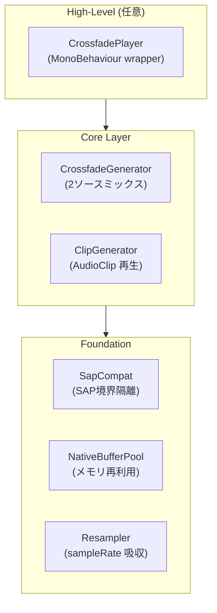

<p align="center">
  <h1 align="center">🎵 SapCrossfadeAudio</h1>
  <p align="center">
    <strong>Sample-accurate crossfade library for Unity 6.3+ Scriptable Audio Pipeline</strong>
  </p>
  <p align="center">
    <a href="#features">Features</a> •
    <a href="#installation">Installation</a> •
    <a href="#quick-start">Quick Start</a> •
    <a href="#api-reference">API</a> •
    <a href="#architecture">Architecture</a> •
    <a href="Docs/SapCrossfadeAudio_DesignDocument_v1.1.0_Unity6.3_APIAligned.md">Design Doc</a>
  </p>
</p>

<p align="center">
  
  
  
  
</p>

---

## Overview

**SapCrossfadeAudio** は Unity 6.3+ の Scriptable Audio Pipeline（SAP）を活用した、**サンプル精度のクロスフェード再生**を実現する専用ライブラリです。

BGM 遷移などのシーンで、**例外ゼロ**・**アロケーションフリー**な安定したリアルタイムオーディオ処理を提供します。

```csharp
// シンプルな2行でBGMクロスフェード
[SerializeField] CrossfadePlayer player;

player.CrossfadeToB(duration: 2f, CrossfadeCurve.EqualPower);
```

---

## Features

<table>
<tr>
<td width="50%">

### 🎯 Core Features

- **サンプル精度のクロスフェード** - 2ソースの精密なミキシング
- **複数カーブ対応** - Equal-Power / Linear / S-Curve
- **Burst 最適化** - SIMD による高速処理
- **ゼロアロケーション** - GC スパイクなし

</td>
<td width="50%">

### 🛡️ Robustness

- **例外ゼロポリシー** - 未設定/エラー時も無音で継続
- **SAP 互換層** - API 変更への耐性
- **冪等な Release** - 複数回呼び出しても安全
- **再 Configure 耐性** - デバイス切り替え対応

</td>
</tr>
<tr>
<td width="50%">

### ⚡ Performance

- **Control/Realtime 分離** - スレッドセーフ設計
- **メモリプーリング** - NativeBuffer 再利用
- **リサンプリング** - sampleRate 不一致を吸収

</td>
<td width="50%">

### 📦 Integration

- **外部依存ゼロ** - コアは Burst のみ
- **Addressables 対応** - 別 asmdef で分離
- **非 MonoBehaviour 対応** - DI/ステートマシン統合

</td>
</tr>
</table>

---

## Requirements

| 項目 | 要件 |
|------|------|
| **Unity** | 6.3 以降（SAP 対応） |
| **必須パッケージ** | `com.unity.burst` |
| **任意パッケージ** | `com.unity.addressables`（別 asmdef） |

---

## Installation

### Manual Installation (Recommended)

1. Clone or download this repository
2. Copy the `Assets/Plugins/unity-sap-crossfade-audio` folder to your project

### Git URL (Alternative)

Add via Unity Package Manager:

```
https://github.com/tomoludens/unity-sap-crossfade-audio.git?path=Assets/Plugins/unity-sap-crossfade-audio
```

---

## Quick Start

### Step 1: Generator Assets の作成

1. **Project ウィンドウで右クリック**
2. **Create > SapCrossfadeAudio > Generators** から作成

```
ClipGenerator (Source A) ─┐
                          ├─► CrossfadeGenerator
ClipGenerator (Source B) ─┘
```

### Step 2: AudioSource への設定

```csharp
// Inspector で設定
[SerializeField] AudioSource audioSource;
[SerializeField] CrossfadeGeneratorAsset crossfadeGenerator;

void Start()
{
    audioSource.generator = crossfadeGenerator;
    audioSource.Play();
}
```

`AddressableClipGeneratorAsset` には未 preload 時のフォールバックとして同期ロード（`WaitForCompletion()`）がありますが、
CPU スパイク要因になるためデフォルトでは無効です（`_allowSynchronousLoadFallback` を明示的に有効化した場合のみ）。

### Step 3: クロスフェード実行

```csharp
using SapCrossfadeAudio.Runtime.Core.Integration;
using SapCrossfadeAudio.Runtime.Core.Types;

var handle = CrossfadeHandle.FromAudioSource(audioSource);
handle.TryCrossfade(targetPosition01: 1f, durationSeconds: 2f, curve: CrossfadeCurve.EqualPower);
```

---

## Usage Examples

### Basic: MonoBehaviour での制御

```csharp
using UnityEngine;
using SapCrossfadeAudio.Runtime.Core.Integration;
using SapCrossfadeAudio.Runtime.Core.Types;

public class BgmController : MonoBehaviour
{
    [SerializeField] private AudioSource _audioSource;

    public void CrossfadeToTrackB(float duration = 2f)
    {
        var handle = CrossfadeHandle.FromAudioSource(_audioSource);
        handle.TryCrossfadeToB(durationSeconds: duration, curve: CrossfadeCurve.EqualPower);
    }

    public void CrossfadeToTrackA(float duration = 2f)
    {
        var handle = CrossfadeHandle.FromAudioSource(_audioSource);
        handle.TryCrossfadeToA(durationSeconds: duration, curve: CrossfadeCurve.EqualPower);
    }
}
```

### Advanced: 即時切り替え

```csharp
// フェードなしで即座に切り替え
var handle = CrossfadeHandle.FromAudioSource(audioSource);
handle.TrySetImmediate(position01: 1f);
```

### Advanced: カスタムカーブの選択

```csharp
// Equal-Power: エネルギー一定（推奨）
CrossfadeCurve.EqualPower  // wA = cos(p × π/2), wB = sin(p × π/2)

// Linear: 線形
CrossfadeCurve.Linear      // wA = 1 - p, wB = p

// S-Curve: スムーズステップ
CrossfadeCurve.SCurve      // smoothstep 補間
```

### Recommended: CrossfadePlayer を使用

最も簡単な方法は、CrossfadePlayer コンポーネントを使用することです。

```csharp
using UnityEngine;
using SapCrossfadeAudio.Runtime.Core.Components;
using SapCrossfadeAudio.Runtime.Core.Types;

public class BgmManager : MonoBehaviour
{
    [SerializeField] private CrossfadePlayer _player;

    public void OnBattleStart()
    {
        _player.CrossfadeToB(2f, CrossfadeCurve.EqualPower);
    }

    public void OnBattleEnd()
    {
        _player.CrossfadeToA(3f, CrossfadeCurve.EqualPower);
    }

    public void OnMenuOpen()
    {
        _player.SetImmediate(0f); // 即時切り替え
    }
}
```

### CrossfadeHandle: 非 MonoBehaviour 制御

DI やステートマシンから制御する場合は CrossfadeHandle を使用します。

```csharp
using SapCrossfadeAudio.Runtime.Core.Integration;
using SapCrossfadeAudio.Runtime.Core.Types;

public class AudioService
{
    private CrossfadeHandle _handle;

    public void Initialize(AudioSource source)
    {
        _handle = CrossfadeHandle.FromAudioSource(source);
    }

    public void CrossfadeTo(float position, float duration)
    {
        if (_handle.IsValid)
        {
            _handle.TryCrossfade(position, duration, CrossfadeCurve.EqualPower);
        }
    }
}
```

### Addressables: 遅延ロード対応

Addressables を使用する場合は、事前ロードでヒッチを回避できます。

```csharp
using SapCrossfadeAudio.Addressables;

public class AddressableBgmManager : MonoBehaviour
{
    [SerializeField] private AddressableClipGeneratorAsset _generator;
    [SerializeField] private AudioSource _audioSource;

    async void Start()
    {
        // 事前ロード（ヒッチ回避）
        await _generator.PreloadAsync();

        if (_generator.IsReady)
        {
            _audioSource.generator = _generator;
            _audioSource.Play();
        }
    }

    void OnDestroy()
    {
        // 冪等な解放（何度呼んでも安全）
        _generator.Release();
    }
}
```

---

## API Reference

### CrossfadeCurve

```csharp
public enum CrossfadeCurve
{
    EqualPower,  // エネルギー一定（推奨）
    Linear,      // 線形補間
    SCurve       // スムーズステップ
}
```

### CrossfadeGeneratorAsset

| プロパティ | 型 | 説明 |
|-----------|-----|------|
| `sourceA` | `ScriptableObject` | ソース A（IAudioGenerator） |
| `sourceB` | `ScriptableObject` | ソース B（IAudioGenerator） |
| `initialPosition01` | `float` | 初期フェード位置（0-1） |
| `initialCurve` | `CrossfadeCurve` | 初期カーブ |

### CrossfadeHandle

非 MonoBehaviour から CrossfadeGenerator を操作するための軽量ハンドル。

```csharp
public readonly struct CrossfadeHandle
{
    public bool IsValid { get; }
    public bool TryCrossfade(float target, float duration, CrossfadeCurve curve);
    public bool TryCrossfadeToA(float duration, CrossfadeCurve curve);
    public bool TryCrossfadeToB(float duration, CrossfadeCurve curve);
    public bool TrySetImmediate(float position);

    public static CrossfadeHandle FromAudioSource(AudioSource source);
}
```

### CrossfadePlayer

Inspector 統合用の MonoBehaviour ラッパー。

| メソッド | 説明 |
|---------|------|
| `Play()` | Generator を設定して再生開始 |
| `Stop()` | 再生停止 |
| `CrossfadeToA(duration, curve)` | Source A へクロスフェード |
| `CrossfadeToB(duration, curve)` | Source B へクロスフェード |
| `Crossfade(target, duration, curve)` | 指定位置へクロスフェード |
| `SetImmediate(position)` | 即座に位置を設定 |

| プロパティ | 型 | 説明 |
|-----------|-----|------|
| `Handle` | `CrossfadeHandle` | 現在の操作ハンドル |
| `IsPlaying` | `bool` | 再生中かどうか |
| `AudioSource` | `AudioSource` | 内部の AudioSource |

### AddressableClipGeneratorAsset

Addressables を使用した AudioClip ジェネレーター。

| メソッド | 説明 |
|---------|------|
| `PreloadAsync()` | アセットを事前ロード |
| `Release()` | アセットを解放（冪等） |

| プロパティ | 型 | 説明 |
|-----------|-----|------|
| `IsReady` | `bool` | ロード済みで再生可能か |

---

## Architecture



### Data Flow

```
Asset (SO)  ──CreateInstance()──►  GeneratorInstance
                                         │
              ┌──────────────────────────┼──────────────────────────┐
              ▼                          ▼                          ▼
         Control              Pipe      Realtime        Buffer     Output
        (Main Thread) ───────────────► (Audio Thread) ──────────► AudioSource
```

### Design Principles

| 原則 | Control（メイン） | Realtime（オーディオ） |
|------|------------------|----------------------|
| メモリ確保 | ✅ Persistent | ❌ 禁止 |
| Unity API | ✅ 許可 | ❌ 禁止 |
| 例外送出 | ⚠️ 最小限 | ❌ 禁止 |
| Burst | ❌ 非対応 | ✅ 対応 |

---

## Crossfade Curves

| カーブ | 特性 | 数式 | 用途 |
|--------|------|------|------|
| **EqualPower** | エネルギー一定 | `wA = cos(p × π/2)`<br>`wB = sin(p × π/2)` | 推奨（音量の谷がない） |
| **Linear** | 線形 | `wA = 1 - p`<br>`wB = p` | シンプル |
| **SCurve** | スムーズ | `s = p² × (3 - 2p)` | 滑らかな遷移 |

---

## Technical Notes

### AudioClip の制約

| LoadType | GetData | 備考 |
|----------|---------|------|
| **DecompressOnLoad** | ✅ | 推奨 |
| CompressedInMemory | ⚠️ | 動作する場合あり |
| Streaming | ❌ | **動作しない**（Unity 仕様） |

### Thread Safety

- **Main → Audio**: `Pipe.SendData()` で安全に通信
- **Audio → Main**: 直接通信は非推奨

### Memory Management

- **バッファプール上限**: 8M floats ≒ 32MB
- **サイズ別上限**: 8 個/サイズ

`NativeBufferPool` は `Allocator.Persistent` を使用しますが、以下のタイミングで自動的に `Clear()` されます。

- PlayMode 終了時（Editor）
- Assembly reload 前（Editor）
- SubsystemRegistration（初期化）
- Application 終了時（Player）

---

## Directory Structure

```text
SapCrossfadeAudio/
├── Addressables/                                        # Optional (separate asmdef)
│   ├── AddressableClipGeneratorAsset.cs                 # Addressables AudioClip generator
│   ├── IPreloadableAudioGenerator.cs                    # Preload interface
│   └── SapCrossfadeAudio.Addressables.asmdef
├── Editor/
│   ├── NativeBufferPoolEditorCleanup.cs                  # Editor cleanup hooks
│   └── SapCrossfadeAudio.Editor.asmdef
├── Runtime/
│   └── Core/
│       ├── AssemblyInfo.cs                              # InternalsVisibleTo (for tests)
│       ├── SapCrossfadeAudio.Core.asmdef                # Core asmdef (Burst only)
│       ├── Components/
│       │   └── CrossfadePlayer.cs                       # MonoBehaviour wrapper
│       ├── Foundation/
│       │   ├── ClipRequirements.cs                      # AudioClip validation
│       │   ├── NativeBufferPool.cs                      # Memory pooling
│       │   ├── SapCompat.cs                             # SAP boundary isolation
│       │   ├── Logging/
│       │   │   ├── CrossfadeLogger.cs                   # Conditional logger
│       │   │   └── TypeTagCache.cs                      # Logger type tag cache
│       │   └── Resampling/
│       │       ├── ResampleMode.cs                      # Auto/Off/Force enum
│       │       ├── ResampleQuality.cs                   # Nearest/Linear/Hermite4 enum
│       │       └── Resampler.cs                         # Interpolation methods
│       ├── Generators/
│       │   ├── Clip/
│       │   │   ├── ClipGeneratorAsset.cs                # AudioClip generator asset
│       │   │   ├── ClipGeneratorControl.cs              # Control-side state
│       │   │   └── ClipGeneratorRealtime.cs             # Burst-compiled realtime
│       │   └── Crossfade/
│       │       ├── ChannelBufferCompat.cs               # Buffer compatibility
│       │       ├── CrossfadeGeneratorAsset.cs           # Crossfade generator asset
│       │       ├── CrossfadeGeneratorControl.cs         # Control-side state
│       │       └── CrossfadeGeneratorRealtime.cs        # Burst-compiled realtime
│       ├── Integration/
│       │   └── CrossfadeHandle.cs                       # Non-MonoBehaviour control
│       └── Types/
│           ├── CrossfadeCommand.cs                      # Crossfade command struct (internal)
│           ├── CrossfadeCurve.cs                        # EqualPower/Linear/SCurve enum
│           ├── CrossfadeRealtimeParams.cs               # Realtime parameters
│           ├── IPcmPageProvider.cs                      # PCM streaming interface
│           └── PageReady.cs                             # Page ready state
└── Tests/
    ├── Editor/                                          # EditMode tests
    │   ├── CrossfadeCommandTests.cs
    │   ├── NativeBufferPoolTests.cs
    │   ├── ResamplerTests.cs
    │   └── SapCrossfadeAudio.Tests.Editor.asmdef
    └── Runtime/                                         # PlayMode tests
        ├── CrossfadeHandleTests.cs
        ├── CrossfadePlayerTests.cs
        └── SapCrossfadeAudio.Tests.Runtime.asmdef
```

---

## Testing

### Running Tests

**In Unity Editor**:
1. Open Window > General > Test Runner
2. Select EditMode or PlayMode tab
3. Click "Run All" or select specific tests

### Test Coverage

| Category | Test Class | Coverage |
|----------|------------|----------|
| **EditMode** | `NativeBufferPoolTests` | Rent/Return, pool limits, idempotency |
| **EditMode** | `ResamplerTests` | Nearest/Linear/Hermite4 interpolation accuracy |
| **EditMode** | `CrossfadeCommandTests` | Internal crossfade command creation, field validation |
| **PlayMode** | `CrossfadeHandleTests` | Command dispatch, IsValid checks |
| **PlayMode** | `CrossfadePlayerTests` | MonoBehaviour integration, playback control |

### Running Tests via Command Line

```bash
# EditMode tests
Unity.exe -runTests -batchmode -projectPath . -testPlatform EditMode -testResults results.xml

# PlayMode tests  
Unity.exe -runTests -batchmode -projectPath . -testPlatform PlayMode -testResults results.xml
```

---

## When to Use This Library

### ✅ Best For

- **BGM 遷移** - シームレスな音楽切り替え
- **サンプル精度が必要な演出** - 厳密なタイミング制御
- **Burst 最適化が必要** - 低レイテンシ要件

### ❌ Consider Alternatives

| 要件 | 推奨 |
|------|------|
| 一般的な BGM フェード | AudioMixer |
| 複雑なインタラクティブ音楽 | FMOD / Wwise |
| 3D 空間音響 | Unity Audio |

---

## Troubleshooting

### よくある問題

<details>
<summary><strong>音が出ない</strong></summary>

1. AudioSource が Play() されているか確認
2. AudioClip の LoadType が `DecompressOnLoad` か確認
3. `generatorInstance` が有効か確認:
   ```csharp
   if (!ControlContext.builtIn.Exists(audioSource.generatorInstance))
       Debug.LogWarning("Generator not active");
   ```

</details>

<details>
<summary><strong>クロスフェードが反映されない</strong></summary>

1. コマンド送信前に `Exists()` チェック
2. `DurationSeconds` が 0 以上か確認
3. `TargetPosition01` が 0-1 の範囲か確認

</details>

<details>
<summary><strong>Burst コンパイルエラー</strong></summary>

1. `com.unity.burst` パッケージがインストールされているか確認
2. Unity 6.3 以降を使用しているか確認

</details>

---

## Contributing

バグ報告や機能リクエストは [Issues](../../issues) へお願いします。

プルリクエストも歓迎です！

---

## License

This project is licensed under the MIT License - see the [LICENSE](LICENSE) file for details.

```
MIT License
Copyright (c) 2026 Tomo Ludens
```

---

## Acknowledgments
- [New in Unity 6.3 - Unity Manual](https://docs.unity3d.com/6000.3/Documentation/Manual/WhatsNewUnity63.html)
- [Scriptable audio pipeline - Unity Manual](https://docs.unity3d.com/6000.3/Documentation/Manual/audio-scriptable-processors.html)
- [Scriptable processors concepts - Unity Manual](https://docs.unity3d.com/Manual/audio-scriptable-processors-concepts.html)
- [Example: Create a root output - Unity Manual](https://docs.unity3d.com/6000.3/Documentation/Manual/audio-scriptable-processors-example-creating-a-root-output.html)
- [AudioSettings.GetDSPBufferSize - Unity Scripting API](https://docs.unity3d.com/6000.3/Documentation/ScriptReference/AudioSettings.GetDSPBufferSize.html)
- [Audio in Web - Unity Manual](https://docs.unity3d.com/6000.3/Documentation/Manual/webgl-audio.html)
- [Unity 6000.3.0f1 Release Notes - Unity](https://unity.com/releases/editor/whats-new/6000.3.0)
- [Unity SAP Documentation](https://docs.unity3d.com/6000.4/Documentation/Manual/audio-scriptable-processors.html)
